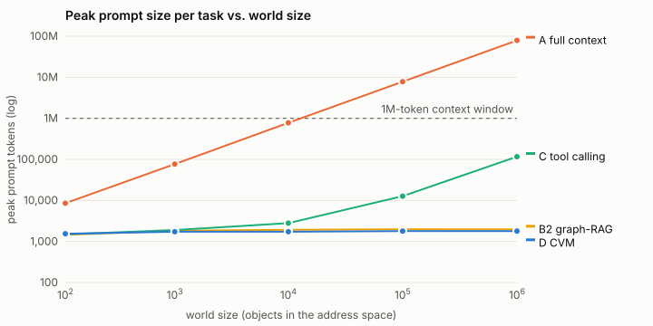
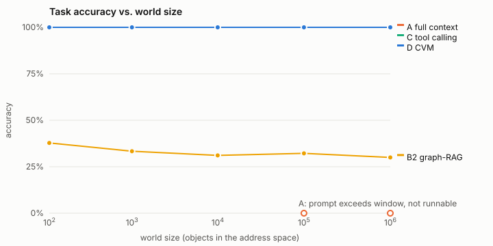

# CVM v0: results

This report has everything measured for CVM v0. For what CVM is and how to use
it, see [README.md](README.md); for next steps, see [PLAN_V1.md](PLAN_V1.md).

## Summary

| Question | Answer | Evidence |
|---|---|---|
| Does the resident context stay bounded as the world grows? | **Yes.** About 9–12 objects and about 2k tokens from 10² to 10⁶ objects | Reference processor at every scale; DeepSeek-V4.1-Flash at 10³ and 10⁶ |
| Can a real LLM solve tasks over a 10⁶-object world this way? | **Yes, at 0.70 accuracy**, no lower than at 10³ (0.53, small n) | 30 + 15 live tasks |
| Do the alternatives scale? | **No.** Full context can't run past ~10⁴ objects. Tool calling that returns whole objects grows from 1.5k to 116k tokens. One-shot RAG scores 0.12–0.38 | Scale experiment, 90 tasks per size |
| Are unsupported claims stopped? | **Yes.** 9,600 of 9,600 fabricated answers were rejected. With the LLM, 18–26% of answers were rejected and re-cited, and 0 unsupported answers were accepted | Verifier ablation and live runs |
| What makes a small working set work? | **Model-written notes.** Without them, accuracy is 0 with a 96% re-fetch (thrash) rate. With them, tasks solve with 2 resident objects | Working-set ablation |
| Where does it fall short? | **Reasoning quality of the model.** Root-cause accuracy was 0.40 with DeepSeek-V4.1-Flash: it takes the decoy or runs out of steps | Live traces |

All raw data is in [`results/`](results/). Every number here can be
reproduced with the commands in [README.md](README.md#reproduce-the-results).

## What is being validated, and by what

**The processor in these results is not an LLM.** No model API credentials were
available where this was built. All numbers below come from `ReferenceReasoner`.
It is a deterministic, stateless policy that maps the **rendered prompt text**
to one operation. It has no handle on the store: everything it knows arrived
through a bounded prompt that the runtime built. It stands in for an ideal
fault-issuing model, so we can measure the *substrate* without LLM noise.

That makes the scope of the claim precise:

| Claim | Status |
|---|---|
| The bounded resident view (≤32 objects, ≤16k tokens) carries enough state to solve multi-hop tasks over a 10⁶-object world | **Validated.** 100% accuracy at every scale, through the prompt only |
| Resident working set and per-step context are independent of world size | **Validated.** ~9.3 peak objects and ~1.8k peak tokens from 10² to 10⁶ |
| Epistemic invariant: unsupported external claims are rejected | **Validated** for the verifier: 9,600/9,600 hallucinated answers rejected, 0 accepted |
| Capabilities are enforced by the runtime, not by the prompt | **Validated** |
| Contexts persist across suspend/resume without reconstruction | **Validated** |
| An LLM can operate inside the substrate with bounded residency at 10⁶ objects | **Validated, modestly.** DeepSeek-V4.1-Flash scored 0.70 at 10⁶ objects vs 0.53 at 10³ (small n, no detectable drop). Peak residency was ~12 objects and ~2k tokens at both sizes; no unsupported answer was accepted (see "Live LLM results") |
| An LLM reasons *well* inside it | **Partly.** Root-cause accuracy was 0.40: the model takes the decoy or runs out of steps. The substrate bounds what it sees, not how well it thinks |

## Synthetic world

`synthetic_world.py` builds clusters (one per org unit), each with about 43
objects: services, hosts, configs, metrics, teams, people, changes, deploys,
incidents and claims. There are also 4 shared platform services whose
in-degree grows linearly with world size. Every cluster has one open incident
with a known causal chain of depth 1–3:

```
cause (change|deploy) -> root service s_d anomalous -> ... -> s_1 anomalous -> s_0 -> incident
```

Distractors are injected so that shortcuts fail:

- a config change on the affected service minutes before the incident
- an older change and a post-anomaly "mitigation" deploy on the root service
- a noisy dependency whose anomaly starts *after* the incident
- a resolved historical incident
- one false claim per cluster

Task kinds (equal mix) are `root_cause` (which change/deploy caused incident X),
`owner` (which team owns the originating service), and `claim` (is claim C
SUPPORTED or CONTRADICTED). Each needs 3 to 10 dereferences. Task complexity
stays constant while the world grows, which is what the spec asks for.

## Conditions

| | Condition | What the processor gets |
|---|---|---|
| A | Full context | the whole world, every object and fact, in one prompt (one shot). Not runnable once it exceeds a 1M-token window |
| B | RAG | top-24 objects by BM25 over the question (one shot) |
| B2 | Graph-RAG | B plus 3-hop expansion along outgoing edges, capped at 64 objects (one shot) |
| C | Tool calling | same operations, but results come back as **whole objects** (including inverse edges such as a hub's dependents), and the transcript keeps everything (no eviction) |
| D | CVM | handles rather than objects, bounded LRU working set (32 objects / 16k tokens), explicit FAULT, notes, provenance verifier |

The same reasoner runs in all five conditions. In one-shot conditions, when it
would need a dereference it cannot issue, it falls back to a best guess from
what is resident.

## Results: the headline experiment

90 tasks per world size, with the same task mix at every size. Tokens are
estimated as chars/4.




| world objects | condition | accuracy | peak resident objects | peak prompt tokens | total prompt tokens / task | steps |
|---:|---|---:|---:|---:|---:|---:|
| 112 | A full context | 1.00 | 112 | 8,557 | 8,557 | 1 |
| 112 | B2 graph-RAG | 0.38 | 15.3 | 1,455 | 1,455 | 1 |
| 112 | C tool calling | 1.00 | 9.8 | 1,491 | 7,247 | 8.1 |
| 112 | **D CVM** | **1.00** | **8.1** | **1,547** | 26,359 | 26.7 |
| 1,015 | A full context | 1.00 | 1,015 | 76,857 | 76,857 | 1 |
| 1,015 | C tool calling | 1.00 | 12.2 | 1,902 | 10,774 | 9.3 |
| 1,015 | **D CVM** | **1.00** | **9.3** | **1,727** | 33,493 | 30.5 |
| 10,002 | A full context | 1.00 | 10,002 | 778,045 | 778,045 | 1 |
| 10,002 | C tool calling | 1.00 | 12.3 | 2,798 | 16,470 | 9.1 |
| 10,002 | **D CVM** | **1.00** | **9.2** | **1,732** | 33,222 | 30.0 |
| 100,001 | A full context | not runnable | n/a | 7.8M | n/a | n/a |
| 100,001 | C tool calling | 1.00 | 12.6 | 12,698 | 90,711 | 9.4 |
| 100,001 | **D CVM** | **1.00** | **9.4** | **1,790** | 35,494 | 31.1 |
| 999,991 | A full context | not runnable | n/a | 79M | n/a | n/a |
| 999,991 | B RAG | 0.21 | 9.3 | 571 | 571 | 1 |
| 999,991 | B2 graph-RAG | 0.30 | 24.7 | 1,973 | 1,973 | 1 |
| 999,991 | C tool calling | 1.00 | 12.5 | 116,229 | 796,256 | 9.3 |
| 999,991 | **D CVM** | **1.00** | **9.3** | **1,793** | 34,835 | 30.5 |

Unsupported-claim rate is 0.00 everywhere. B/B2 rows at other sizes are in
`results/scale.json`; accuracy stays between 0.12 and 0.38.

CVM-specific metrics, same runs:

| world objects | virtualization ratio N / peak WS | cognitive locality | fault precision | faults | external I/O |
|---:|---:|---:|---:|---:|---:|
| 112 | 16 | 0.38 | 0.36 | 7.5 | 32.0 |
| 10,002 | 1,229 | 0.38 | 0.36 | 8.5 | 36.3 |
| 999,991 | **121,518** | 0.38 | 0.36 | 8.7 | 36.9 |

At 10⁶ objects, CVM by depth: depth 1, 2 and 3 all reach 1.00 accuracy, with
9.1, 9.5 and 9.5 peak objects and 1.73k, 1.82k and 1.84k peak tokens. Context
cost tracks **task complexity**, not world size.

### Reading the results honestly

- **The spec's §34 success criteria are met for the substrate.** At 10⁶
  objects, CVM accuracy (1.00) equals full-context accuracy at small scale.
  Peak resident objects are about 9 (well under 50). Per-task tokens are flat
  across four orders of magnitude, and no unsupported claims are accepted.
  The virtualization ratio is about 1.2×10⁵.
- **Full context** is exact while it fits and simply cannot run past ~10⁴
  objects.
- **One-shot retrieval (B, B2)** stays small but cannot plan. Multi-hop
  root-cause tasks need dereferences chosen *after* seeing intermediate state.
  B2 mostly falls for the "latest change before the incident" trap.
- **Tool calling (C) is the honest competitor.** Its accuracy matches CVM here
  because its prompt still fits in 1M tokens. Its context grows with world
  size, though: 1.5k → 116k peak, 7k → 796k total tokens per task. The growth
  comes from treating results as serialized objects rather than references:
  traversing to a shared platform service pulls in its ~14k dependents. That
  gap is the CVM thesis (handles, not objects), and it is a modeling choice
  in C. A tool API that paginates and returns ids would behave more like D.
  What C lacks is the bounded-residency *guarantee* plus provenance and
  capabilities.
- **CVM is not free.** At small worlds C spends fewer total tokens: CVM takes
  ~30 steps (about a third are `WRITE`s that persist conclusions) versus ~9,
  and every step re-sends the resident view. CVM's total is flat (~35k/task),
  so the crossover here is between 10⁴ and 10⁵ objects. Batching
  WRITEs or caching the stable prompt prefix would lower the constant.

## Results: ablations at 10⁶ objects (`results/ablations.json`)

**Working-set size and thrashing.** This is the clearest OS analogy that held up.

| resident objects | notes (WRITE) | accuracy | thrash rate | steps |
|---:|---|---:|---:|---:|
| 2 / 4 / 8 / 32 | on | 1.00 / 1.00 / 1.00 / 1.00 | 0.00 | 30.3 |
| 2 | off | 0.00 | 0.96 | 80 (step limit) |
| 4 | off | 0.03 | 0.90 | 77.7 |
| 8 | off | 0.33 | 0.58 | 58.0 |
| 16 / 32 | off | 1.00 | 0.00 | 18.4 |

Without a place to keep conclusions, a working set smaller than the task's
footprint produces textbook **cognitive thrashing**: the same objects are
faulted, evicted and faulted again until the step limit. With model-written
notes (budgeted, never silently evicted, each citing fact ids) the task solves
with **two** resident objects. The notes are the context's execution state.
This finding was not in the spec: residency alone is not enough, and the context
needs a small register file the processor controls.

**L2 cache and prefetch.** Values are per task.

| configuration | external I/O | demand misses | demand hits |
|---|---:|---:|---:|
| no cache | 36.7 | 9.3 | 0 |
| shared runtime L2 | 33.5 | 8.2 | 1.1 |
| shared L2 + prefetch (on TRAVERSE→service, warm its metrics/config) | 55.8 | 4.7 | 4.6 |
| thrashing (4 objects, no notes), no cache | 223.6 | 72.6 | 0 |
| thrashing, shared L2 | 18.9 | 4.4 | 68.2 |

Prefetch halves demand stalls but costs about 65% more total I/O; about 40% of
prefetches were used. The L2 cache absorbs thrashing I/O (12× less), but it
does not rescue accuracy. That is the right division of labor: caching is an
optimization, not the abstraction.

**Provenance verifier.** A `Hallucinator` that asserts plausible answers
(fabricated fact ids, or no citations) produced 9,600 answers. All were
rejected, none accepted, accuracy 0. The reference reasoner produced 60 answers
with 0 rejections.

**Capabilities.**

- With `SEARCH` revoked, the reasoner gets one `CAPABILITY_FAULT` per namespace,
  then rediscovers events via `TRAVERSE root ~TARGETS`. Accuracy stays 1.00.
- `WRITE service://…`, `SEARCH person://` and `FAULT secret://…` all return
  `CAPABILITY_FAULT`.
- `spawn()` narrows child capabilities to a subset of the parent's: a child
  asking for `SEARCH change://` or `WRITE metrics://` does not get them.

**Context switching.** 24 contexts were interleaved one step at a time, with
717 suspend/resume switches. Answers and step counts were identical to
sequential runs, with 0 re-materializations after resume. A context is resumed,
not reconstructed from history.

## Live LLM results: DeepSeek-V4.1-Flash as the processor

Setup: the same runtime, the same 32-object / 16k-token working set and the same
generic system prompt (no investigation-method hints). Each step is one
stateless JSON-mode call, temperature 0, at most 50 steps. Results are in
`results/llm_deepseek-flash_cvm_{1e3,1e6}.json` with full operation traces in
`*_traces.jsonl`. Budget limited the 10³ run to 15 tasks.

| | 10³ world (1,015 objects) | 10⁶ world (999,991 objects) |
|---|---:|---:|
| tasks | 15 | 30 |
| **accuracy** | **0.53** | **0.70** |
| root cause / owner / claim | 0.40 / 1.00 / 0.20 | 0.40 / 0.80 / 0.90 |
| depth 1 / 2 / 3 | 0.50 / 0.60 / 0.50 | 0.85 / 0.67 / 0.50 |
| peak resident objects (mean / max) | 11.5 / 18 | 12.3 / 21 |
| peak prompt tokens (mean / max) | 1,874 / 2,646 | 1,970 / 3,072 |
| runtime prompt tokens per task | 37.0k | 41.5k |
| steps per task | 28.2 | 29.9 |
| faults per task | 16.8 | 17.7 |
| fault precision / cognitive locality | 0.41 / 0.44 | 0.40 / 0.42 |
| thrash rate | 0.00 | 0.00 |
| answers rejected by verifier (unsupported-claim rate) | 0.18 | 0.26 |
| capability faults per task (retrying denied `claim://`) | 5.4 | 5.4 |
| WRITEs per task | 1.1 | 0.8 |
| hit step limit | 1 | 4 |
| wrong answers: decoy / no answer / other | 2 / 1 / 4 | 3 / 4 / 2 |
| model tokens per task, input / output (incl. reasoning) | 68k / 53k | 75k / 63k |
| API cost | ~$0.54 | ~$1.27 |

Reference: the deterministic reasoner scores 1.00 at both sizes with ~9.3 peak
objects and ~1.8k peak tokens.

**What this shows**

1. **Residency was independent of world size with a real LLM in the loop.**
   Growing the world 1,000× changed peak residency from 11.5 to 12.3 objects and
   peak prompt from 1.87k to 1.97k tokens. The model never saw more than 3.1k
   tokens of world state while working in a 10⁶-object address space, a
   worst-case virtualization ratio of about 48,000 (about 81,000 at mean peak). This part of the thesis
   holds with an LLM, not just with the reference reasoner.
2. **Accuracy did not degrade with world size.** It was 0.53 (n=15) vs 0.70
   (n=30). These samples are small: a 95% interval at n=15 is about ±0.25, so the
   honest reading is "no detectable drop", not "it got better". Root-cause accuracy
   was identical at 0.40 at both sizes. In this world, difficulty tracks task
   depth (0.85 → 0.67 → 0.50 at 10⁶), not world size.
3. **The model is the bottleneck, not the substrate.** Root cause is the hard
   task (0.40). The model either takes the decoy (a change on the affected
   service just before the incident) or runs out of steps exploring. Its
   fault precision of about 0.4 equals the reference reasoner's (0.36–0.38),
   so it is not fetching wildly. It is drawing the wrong conclusion or
   stopping short.
4. **The verifier did real work.** 18–26% of emitted answers were rejected,
   almost all claim verdicts that cited no fact about the claim. The model
   then re-cited and was accepted. No unsupported answer was accepted, but
   **grounded ≠ correct**: every wrong accepted answer cited real facts.
5. **Capabilities held, and the model did not learn from them.** It kept probing
   the denied `claim://` namespace (about 5 faults per task) because the
   resident view advertises `~ABOUT` links.
6. **It uses notes far less than the reference reasoner** (about 1 WRITE per task
   vs about 12). Thrash stayed at 0 only because these tasks fit in 32 objects.
   With a smaller working set this would fail, as the notes ablation predicts.

Cost structure: model input is the resident view re-sent at every step, and
output is dominated by reasoning tokens. Prompt-prefix caching and batched
operations are the obvious levers.

Not run, for lack of budget: the tool-calling baseline with the LLM at 10⁶
(prompts of ~100k tokens per step); `deepseek-v4-pro`; the method-hinted prompt
(`--hint`). The last would separate "cannot reason" from "was not told the
procedure".

An earlier, discarded pilot (`results/llm_deepseek-flash_preliminary_traces.jsonl`)
was corrupted by an adapter bug: DeepSeek sometimes appends tool-call markup
after the JSON object. The adapter now parses the first JSON object. That pilot
also exposed a side channel: incident → `~ABOUT` → claims naming the
candidates. It was closed by giving `claim://` capabilities only to
claim-verification contexts.

## The model-visible prompt

`results/example_trace_1e6.txt` shows a full run against the 10⁶-object world:
24 operations, 8 peak resident objects, and a largest prompt of **1,574
tokens**. Excerpt:

```
CONTEXT ctx://0001   PRINCIPAL agent://incident-debugger
TASK task://0 [root_cause]
  Determine which change or deployment caused incident://inc-k10611.

RESIDENT OBJECTS (8/32 objects, 690/16000 tokens)
incident://inc-k10611  [incident] elevated errors on ads-k10611
  [fact:2] started_at = 2026-03-27T23:49Z
  [fact:5] AFFECTS -> service://ads-k10611
  (~ABOUT: 2 refs, use TRAVERSE ~ABOUT)
metrics://ledger-k10611  [metrics] latency for service://ledger-k10611
  [fact:8] anomaly_start = 2026-03-27T23:37Z
  [fact:12] status = anomalous
...
NOTES (scratch://0001, 9/48)
  status:service://ledger-k10611 = anomalous@2026-03-27T23:37Z | fact:7,fact:12,fact:8
...
RULES
  Do not assert external state that is not resident. If you need it, FAULT it.
  ANSWER must cite the fact ids that support it; unsupported answers are rejected.
```

The run ends with:

```
ANSWER deploy://ledger-k10611-cause  support=[fact:2,fact:5,fact:7,fact:12,fact:8,fact:6,fact:43,fact:47] -> ACCEPTED
```

## Known limitations

- The reference reasoner is hand-written for this task family, so its 1.00
  accuracy is by construction. The informative quantities are the residency and
  token curves, the verifier and capability behavior, and the ablations.
- The token counts are chars/4 estimates, not a real tokenizer.
- Locality is built into the world: tasks live in one cluster plus hubs. That
  matches the spec's "constant task complexity", but real worlds may have
  longer-range dependencies.
- `SEARCH` is deterministic BM25 over FTS5, with no embeddings, so retrieval
  quality does not contaminate the result (spec §31).
- V0 resolvers are read-only; `WRITE` is accepted only in the context's
  `scratch://` space.
- Not built, as spec §33 asks: multi-agent orchestration, embeddings,
  summarization, a UI, RL, connectors.

## Files in `results/`

| File | What it is |
|---|---|
| `scale.json` | headline experiment: per-size summaries for all conditions plus every per-task run |
| `ablations.json` | working-set sweep, cache/prefetch, verifier, capabilities, context switching |
| `context_vs_world_size.svg`, `accuracy_vs_world_size.svg` | the two headline charts |
| `example_trace_1e6.txt` | one full reference run at 10⁶ objects, with the largest prompt the processor saw |
| `llm_deepseek-flash_cvm_1e6.json` / `_traces.jsonl` | live DeepSeek run, 30 tasks at 10⁶ objects |
| `llm_deepseek-flash_cvm_1e3.json` / `_traces.jsonl` | live DeepSeek run, 15 tasks at 10³ objects |
| `llm_deepseek-flash_preliminary_traces.jsonl` | discarded pilot (adapter parsing bug); kept for the side-channel finding |
